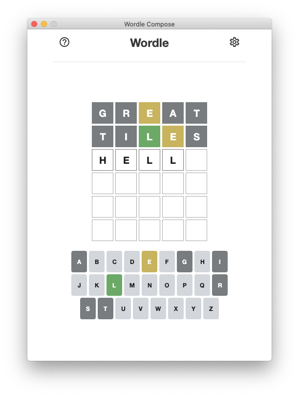
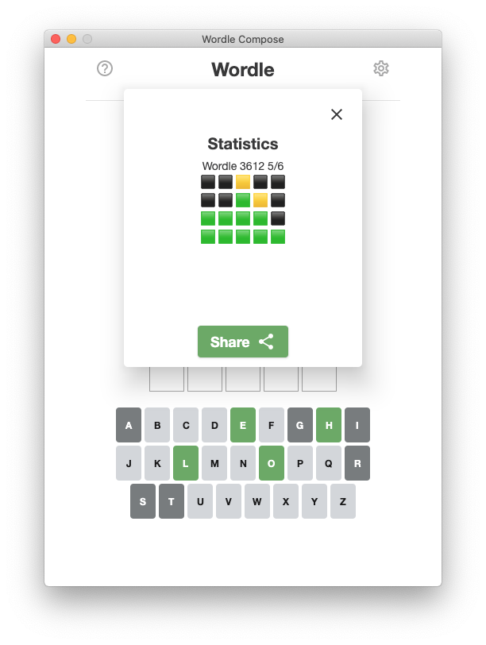
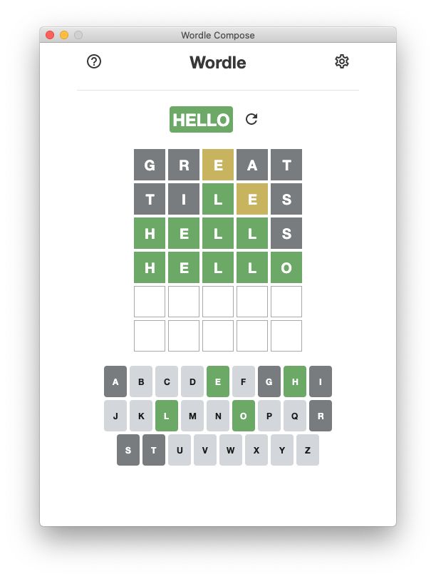
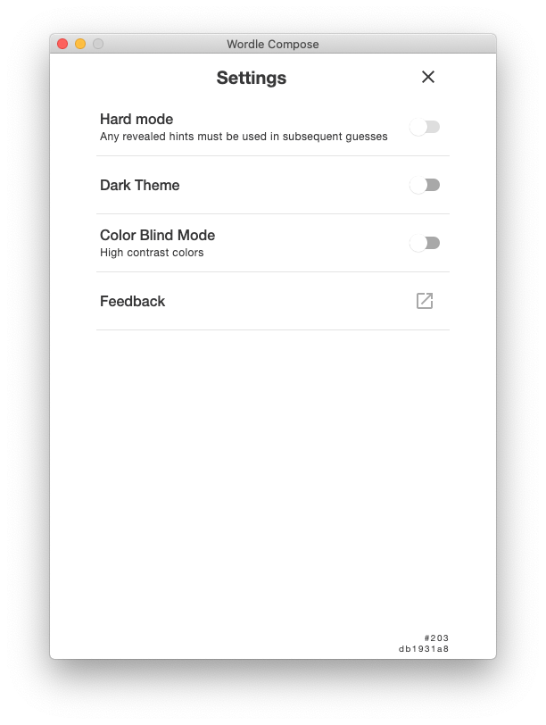
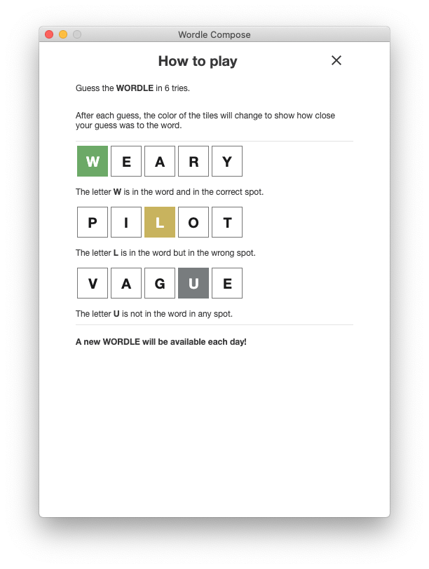
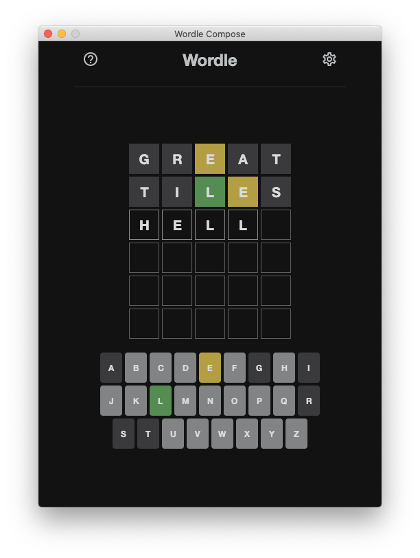
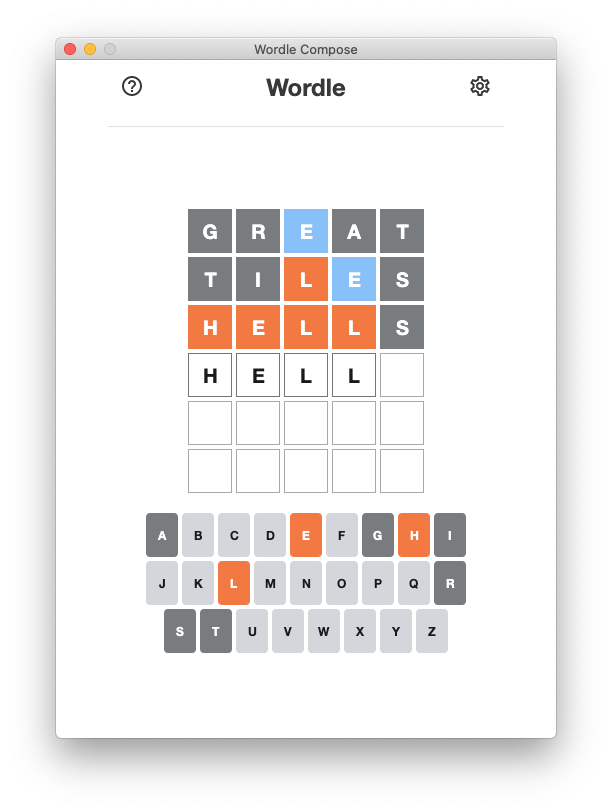
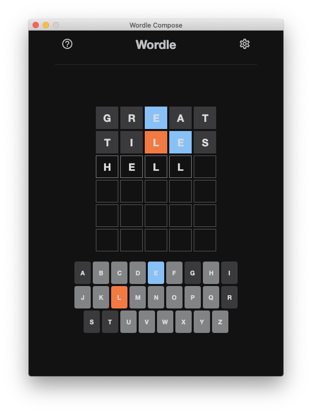

[](https://github.com/opatry/wordle-kt/actions/workflows/Build.yml)

# Wordle Compose

[Wordle game](https://www.powerlanguage.co.uk/wordle/) clone written in Kotlin & using Compose UI Toolkit.

## Screenshots

### Compose for Desktop

#### Main screens

| Playing                                               | Victory                                   | End of game                               | Settings                                   | How to play                             |
|-------------------------------------------------------|-------------------------------------------|-------------------------------------------|--------------------------------------------|-----------------------------------------|
|              |  |  |  |  |

#### Light & Dark mode

| Light 🌞                                               | Dark 🌛                                               |
|--------------------------------------------------------|-------------------------------------------------------|
|               |               |
|  |  |

### Compose for Android

The main UI is displayed in Android devices.

For now, the setup is made quick & dirty and needs improvements (maybe using Kotlin Multi Platform project?).
Sources from the desktop version needs to be copied into the Android project.

```sh
./syncComposeSharedSources.sh
```

Any edit made in the Android copy should be done in the original desktop module afterwards.

Extracting Compose code common to Desktop & Android apps in a shared module would clean this mess but might require specific Gradle setup.
Reason why it might be better to use KMP project setup.

Android support is still very rough and a nice to have for now.

### ASCII/Console mode

```
.---------------.
| Hello Wordle! |
'---------------'
 ➡️ Enter a 5 letter english word: hello
Wordle 189 4/6
T⬛I⬛L🟩E🟨S⬛
G⬛R⬛E🟨A⬛T⬛
T⬛A⬛L🟩E🟨S⬛
H🟩E🟩L🟩L🟩O🟩
 ⬜ ⬜ ⬜ ⬜ ⬜
 ⬜ ⬜ ⬜ ⬜ ⬜
Congrats! You found the correct answer 🎉: HELLO
 🔄 Play again? (y/N) 
 ```

<details>
<summary>Full game…</summary>

```
.---------------.
| Hello Wordle! |
'---------------'
 ⬜ ⬜ ⬜ ⬜ ⬜
 ⬜ ⬜ ⬜ ⬜ ⬜
 ⬜ ⬜ ⬜ ⬜ ⬜
 ⬜ ⬜ ⬜ ⬜ ⬜
 ⬜ ⬜ ⬜ ⬜ ⬜
 ⬜ ⬜ ⬜ ⬜ ⬜

 ➡️ Enter a 5 letter english word: tiles
T⬛I⬛L🟩E🟨S⬛
 ⬜ ⬜ ⬜ ⬜ ⬜
 ⬜ ⬜ ⬜ ⬜ ⬜
 ⬜ ⬜ ⬜ ⬜ ⬜
 ⬜ ⬜ ⬜ ⬜ ⬜
 ⬜ ⬜ ⬜ ⬜ ⬜
Keep going… 1/6
 ➡️ Enter a 5 letter english word: great
T⬛I⬛L🟩E🟨S⬛
G⬛R⬛E🟨A⬛T⬛
 ⬜ ⬜ ⬜ ⬜ ⬜
 ⬜ ⬜ ⬜ ⬜ ⬜
 ⬜ ⬜ ⬜ ⬜ ⬜
 ⬜ ⬜ ⬜ ⬜ ⬜
Keep going… 2/6
 ➡️ Enter a 5 letter english word: tales
T⬛I⬛L🟩E🟨S⬛
G⬛R⬛E🟨A⬛T⬛
T⬛A⬛L🟩E🟨S⬛
 ⬜ ⬜ ⬜ ⬜ ⬜
 ⬜ ⬜ ⬜ ⬜ ⬜
 ⬜ ⬜ ⬜ ⬜ ⬜
Keep going… 3/6
 ➡️ Enter a 5 letter english word: hello
Wordle 189 4/6
T⬛I⬛L🟩E🟨S⬛
G⬛R⬛E🟨A⬛T⬛
T⬛A⬛L🟩E🟨S⬛
H🟩E🟩L🟩L🟩O🟩
 ⬜ ⬜ ⬜ ⬜ ⬜
 ⬜ ⬜ ⬜ ⬜ ⬜
Congrats! You found the correct answer 🎉: HELLO
 🔄 Play again? (y/N) 
```

</details>

## Tech Stack

* [Kotlin](https://kotlinlang.org/)
* [Jetbrains Compose for Desktop](https://www.jetbrains.com/lp/compose/)
* [Jetpack Compose for Android](https://developer.android.com/jetpack/compose)

## Development

To build and run the desktop application, run the following command

```bash
./gradlew run
```

To run tests, run the following command

```bash
./gradlew test
```

To build and package desktop application, run the following command

```bash
./gradlew assembleDist
```

## License

```
The MIT License (MIT)

Copyright (c) 2022 Olivier Patry

Permission is hereby granted, free of charge, to any person obtaining a copy
of this software and associated documentation files (the "Software"), to deal
in the Software without restriction, including without limitation the rights
to use, copy, modify, merge, publish, distribute, sublicense, and/or sell
copies of the Software, and to permit persons to whom the Software is
furnished to do so, subject to the following conditions:

The above copyright notice and this permission notice shall be included in all
copies or substantial portions of the Software.

THE SOFTWARE IS PROVIDED "AS IS", WITHOUT WARRANTY OF ANY KIND, EXPRESS OR
IMPLIED, INCLUDING BUT NOT LIMITED TO THE WARRANTIES OF MERCHANTABILITY,
FITNESS FOR A PARTICULAR PURPOSE AND NONINFRINGEMENT. IN NO EVENT SHALL THE
AUTHORS OR COPYRIGHT HOLDERS BE LIABLE FOR ANY CLAIM, DAMAGES OR OTHER
LIABILITY, WHETHER IN AN ACTION OF CONTRACT, TORT OR OTHERWISE, ARISING FROM,
OUT OF OR IN CONNECTION WITH THE SOFTWARE OR THE USE OR OTHER DEALINGS IN THE
SOFTWARE.
```

